---

## 💫 About Me

- 👨‍💻 **5+ years of experience** building full-stack web applications and cloud solutions
- 🔭 Currently building a **Student Tracking System for the University of Rwanda** and **DevPulse**, a DevOps automation and monitoring platform
- ⚡ **2,000+ GitHub contributions in the last year** across 24+ repositories
- 🌱 Expanding my backend skills with **Python**
- 🎯 Goal: contribute to production systems at scale — open to full-time roles, internships, and freelance work
- 💬 Ask me about **JavaScript, TypeScript, React, and DevOps pipelines**
- 🤝 Open to collaborating on web projects and open-source work

---

## 🛠️ Core Skills

**Languages**
   
**Frontend**
    
**Backend & APIs**
   
**Databases**
   
**DevOps & Cloud**
     
**Tools**
   

---

## 🚀 Featured Projects

| Project | Description | Stack |
|---------|-------------|-------|
| **UR Student Tracking System** *(in progress)* | Student tracking system for the University of Rwanda, monitoring student records and academic progress. | React, Node.js, PostgreSQL |
| **DevPulse** | DevOps automation and monitoring platform. | JavaScript, Docker, CI/CD, Cloud |
| **INUMA — Request Flow Management** | University of Rwanda's request management system, handling institutional request workflows end to end. | React, Node.js, Full-Stack |
| **UR Polyclinic Web Application** | Healthcare management system streamlining patient appointments and hospital workflows. | React, Node.js, PostgreSQL |
| **Hitamo Space — Event Management** | Event management system for seamless organization of events and bookings. | React, Node.js |
| **Umusamariya — Traffic Rules Trainer** | Interactive traffic rules learning platform for driver education. | React, Education |
| **Loveway Logistics** | Comprehensive logistics management application for tracking and operations. | Node.js, Full-Stack |
| [Ones and Zeroes E-Commerce](https://github.com/atlp-rwanda/e-commerce-ones-and-zeroes-fn) | Team-built e-commerce platform following professional Git workflows and CI/CD. | TypeScript, React, Node.js, PostgreSQL |

> 🔗 Live demos and code links for each project are on my [portfolio](https://igor-ihimbazwe.netlify.app/).

---

## 🏅 Achievements & Community

- 🥇 **Winner — Umurava Software Skills Challenge (2025)**: recognized for innovative problem-solving and full-cycle product development in a team setting
- 💡 **Innovator — UR Binary Hub**: building software solutions that address local challenges within Rwanda's tech ecosystem
- 🎓 **Andela Technical Leadership Program (ATLP)**: professional developer training — shipped team products using Git workflows, code review, and CI/CD
- 🧑‍🏫 **Hackathon leadership**: led initiatives where students built solutions for social impact

---

## 🌐 Let's Connect

*Let's create something amazing together.*

